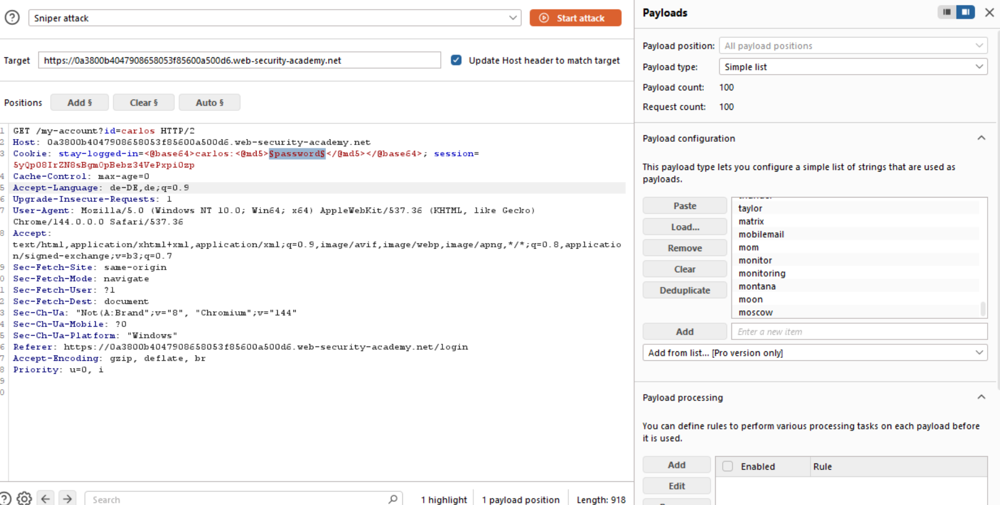
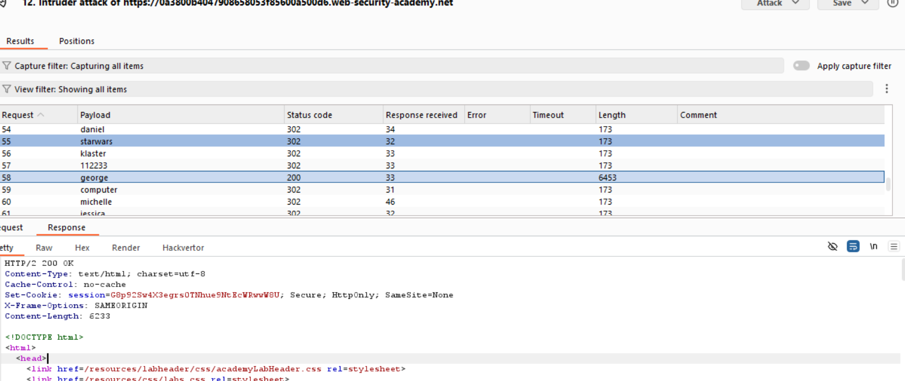

# 01-auth-stay-logged-in

**Brute-forcing a stay-logged-in cookie**  
*PortSwigger Web Security Academy - Practitioner*

## Vulnerability
Weak MD5 hashing in `stay-logged-in` cookie allows offline brute-force attack.

## Tools
- Burp Suite Intruder
- HackVertor Extension
- password list 

## Attack Steps

### 1. Cookie Analysis

                                    

Cookie with `username=Wiener` and `password=peter` is as shown. Decoder analysis shows the cookie was made by a base64 encoded combination of a MD5 hash of the password and the username.
**Cookie Format**: `base64(username:md5(password))`

### 2. Intruder Setup

Change the id to "carlos", as it is the victims username. Build the request as shown with the `HackVertor Extension` and its tags.

### 3. Find the vulnerable response

You can find the response based on its `length` or its `status code`. You now have the password and the username of the victim.
