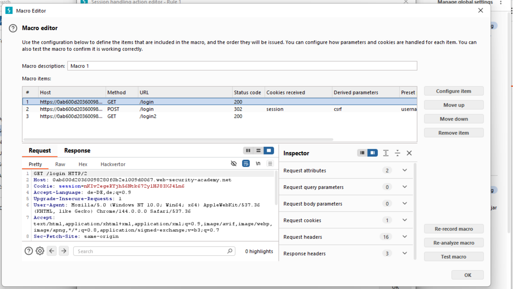
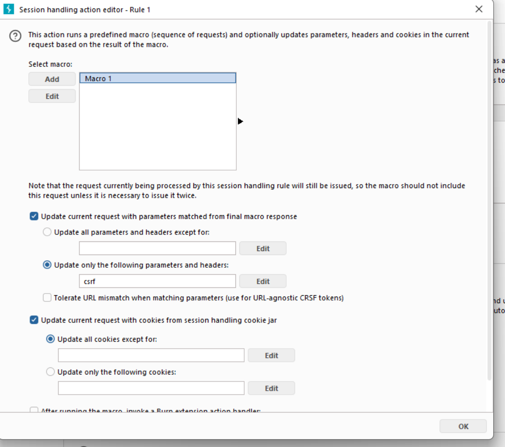
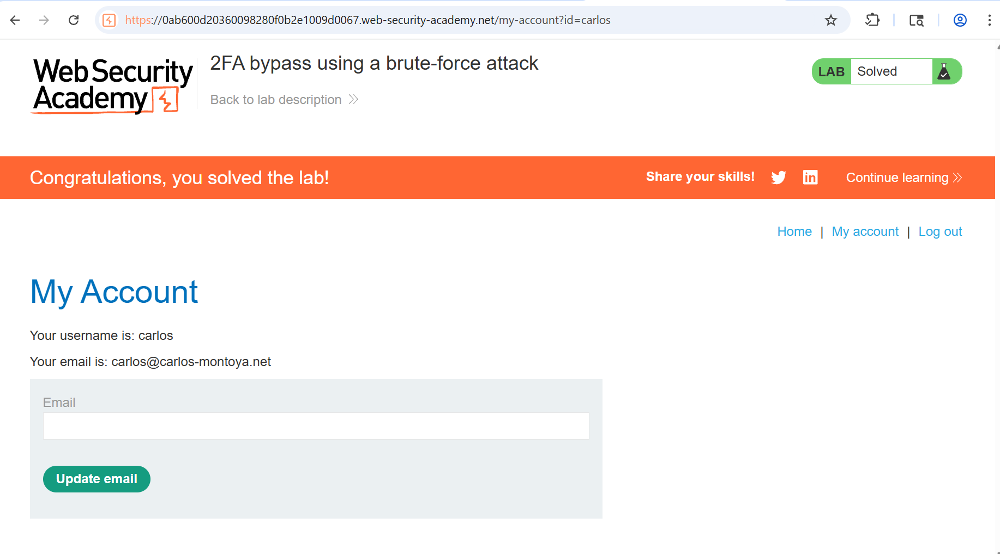

# 03-auth-bruteforcing-2FA

**auth-2FA-bypass-via-macro-supported-bruteforcing**
*PortSwigger Web Security Academy - Expert*

## Vulnerability
This website has a `2FA`. The website implemented a mechanism meant to protect the 2FA code from `bruteforce attacks`.
This consists of the user being `logged out after 2 wrong attempts`. By using `macros` the website is still exploitable.

## Tools
- Turbo Intruder
- Burp Macros

## Attack Steps

After manually simulating the login process in the browser, the macro can be recorded.
### 1. Record the macro
Configure the macro so that the website is ready for the request containing the 2FA code.
This macro contains:
1. One first request, which gets the `csrf parameter` in the response.
2. The second request has to get its `csrf parameter` from the previous response and contains the `username` and the `password`.
3. The third request asks the website for the html template for the 2FA code form and contains the second csrf parameter, which has to be set in the `Macro Editor` in
   order to be passed on to the next request, which is sent by the `Turbo Intruder`.

### 2. build the Turbo Intruder script
The intruder should `enumerate` every number between 0001 and 9999, as the code has 4 digits.
Ensure `concurrent connections` is set to 1 in order to prevent requests being sent in the wrong order.
This can happen because we are using macros.
Note: You might have to run the attacks more than once, as the website has a code reset mechanism.
The attack still works as the code only consists of 4 digits and the reset time is not too short.

### 3. enter the account
The right request should have a status code of 300. You can open this request in the browser or log in manually using the 2FA code from the request.

## Proof

