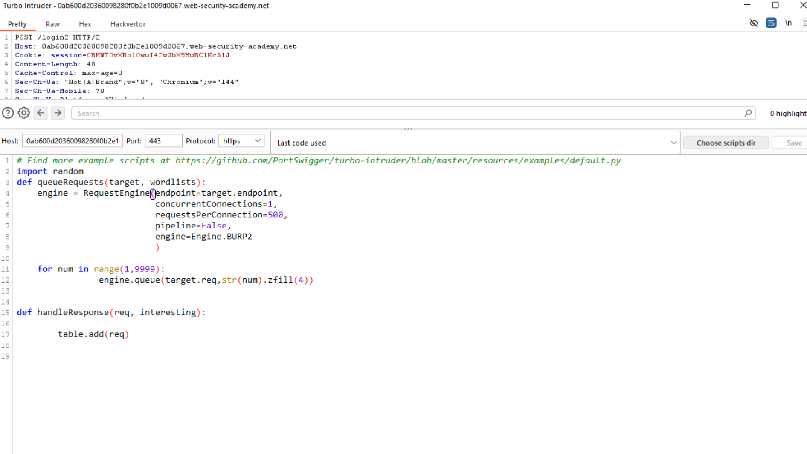
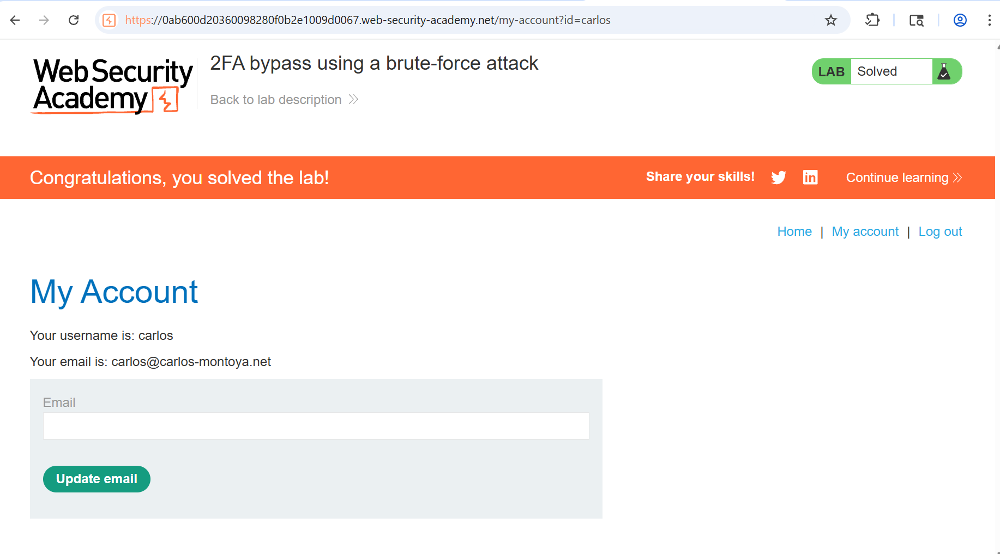

# 04-auth-username-enumeration-response-time

**auth-username-enumeration-via-diffrent-response-time**
*PortSwigger Web Security Academy - Apprentice*

## Vulnerability
The website refuses `POST method requests` by ordinary users on the `URL /admin-roles`. The bypass lies in changing the method to `GET`. 

## Tools
-Burp Repeater

## Attack Steps
### Note:
The Lab lets you know the administrators username and password to observe the `admin panel`.

### 1. Observe the admin panel request 

### 2. build the Turbo Intruder script

# Processing..............

