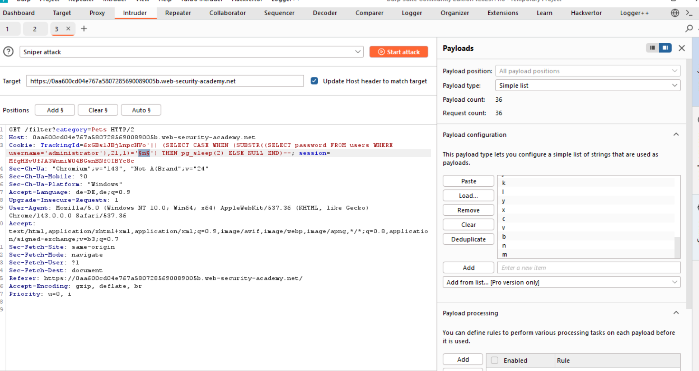

# 05-SQLi-conditional-time-delay

**SQLi information retrieval via conditional time delay**
*PortSwigger Web Security Academy - Practitioner*

## Vulnerability
There is a `SQLi vulnerability` in the `tracking ID`. There is no visible response, but we can `enumerate` the password via conditional time delays. The lab lets us know the username and the password columnname.

## Tools
- Intruder
- Burp repeater
- Database cheat sheet

## Attack Steps

### 1. enumerate the database
We can use the PortSwigger cheat sheet to enumerate the database efficiently.
Oracle und Postgre`TrackingID=abc'|| 'test'--`
MySQLi `TrackingID=abc' 'test'#`
The enumeration responses reveal that the database is Oracle or Postgre.

### 2. build query

You might have to try the two posible syntax for `Postgre and Oracle`.
In this case it was `Postgre`.

### 3. use Intruder to enumerate the password
You could use a cluster bomb attack in order to be able to read the right symbol for the right index.
This attempt is solwer, as you can run 20 attacks manually with the grep pause feature and a sniper attack, so the attacks do not have to be completed.

