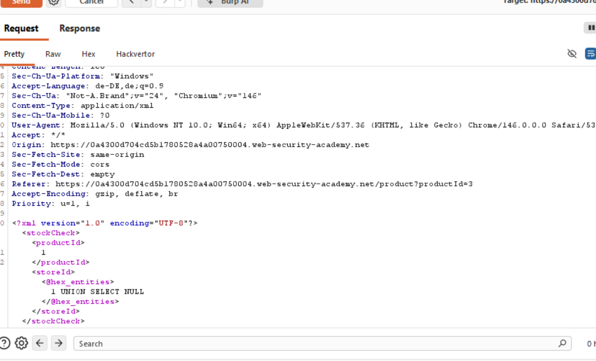
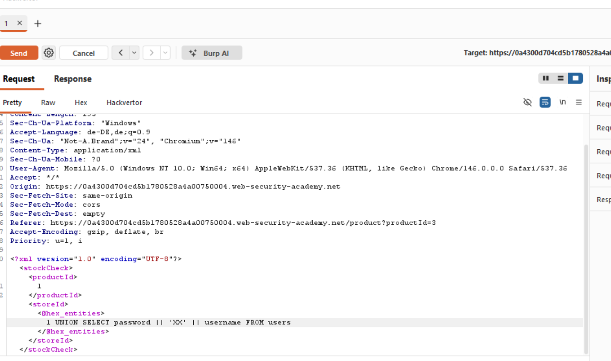
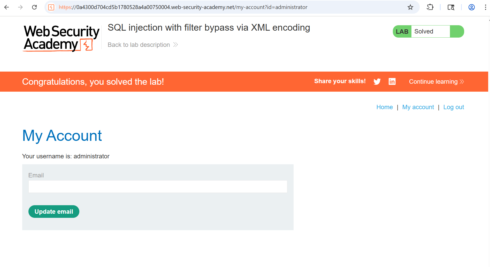

# 06-SQLi-XML-encoding

**SQL injection with filter bypass via XML encoding**
*PortSwigger Web Security Academy - Practitioner*

## Vulnerability
The parameters in the check stock feature are transmitted to the webserver in a XML body. A web application firewall, WAF, blocks all requests showing signs of threads such as SQLi. We can encode the SQLi payload so that the payload is decoded after it passed the filter.

## Tools
- Intruder
- Burp repeater
- Database cheat sheet

## Attack Steps

### 1. Find SQLi in request
The Lab tells us that there is a SQLi vuln in the check stock feature, yet we don't know which parameter is inserted into a SQL query on the backend. So the following payload has to be inserted in both possible parameters `productID` and `storeID`.

### 2. build query
We create the query to check for SQLi possibility with a simple `UNION SELECT NULL`. If we send the request like that we observe that a `attack detected` message appears. To bypass the `WAF` we put hex_entitie tags around the whole SQLi query so the malicious payload is decoded only after the WAF is passed leaving the payload unnoticed. We now know where to inject.

### 3. build the final payload
Now we build the query to reveal the containings of the password and username columns. 

About the query:
* We don't need a ' to escape the string of the parameter because it is passed to the query as a number.
* From the point above we can infer that there is also no need for a -- to comment the second ' out.
* From the 2. Attack step we also know that there is one column returned in the query we add the UNION to so we have to concatenate the password and the username.

## Proof

