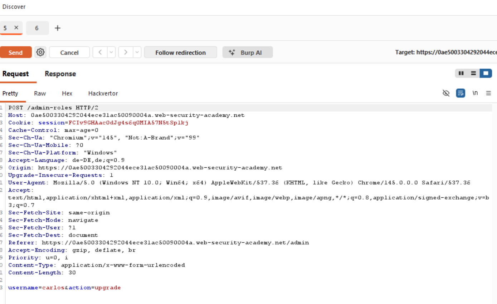
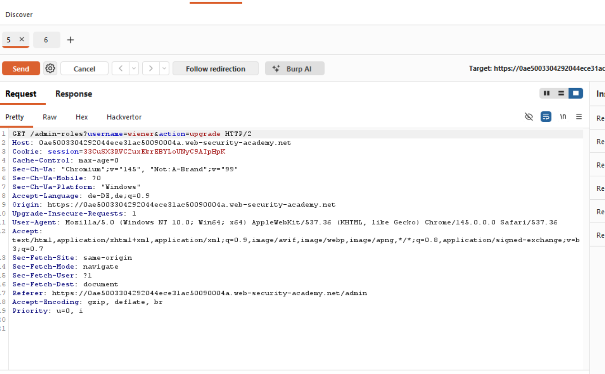
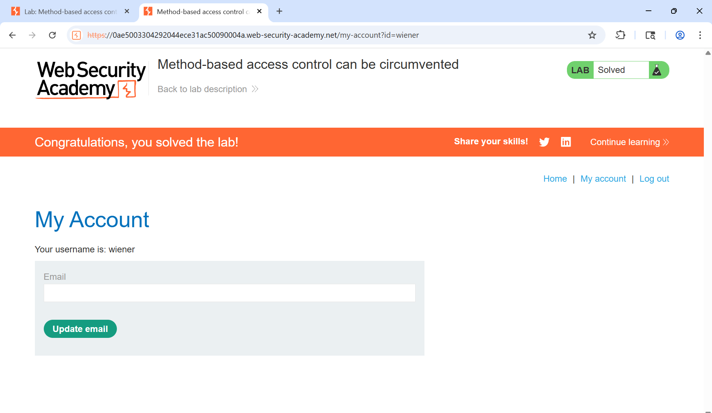

# 07-AC-Method-Based-Bypass

**AC Method based access control can be circumvented**
*PortSwigger Web Security Academy - Practitioner*

## Vulnerability
The website refuses `POST method requests` by ordinary users on the `URL /admin-roles`. The bypass lies in changing the method to `GET`. 

## Tools
-Burp Repeater

## Attack Steps
### Note:
The Lab lets you know the administrators username and password to observe the `admin panel`.

### 1. Observe the admin panel request 
Intercept the request, which upgrades a user and send it to repeater.

### 2. request from ordinary user account
Log in to your account and get the `session cookie` from your session. This cookie belongs to an ordinary user with no `admin access`. Replace the cookie from the request stored in the repeater with this cookie. Replace the parameter `username=carlos` with your own username. So the parameters look like this: `username=wiener&action=upgrade`

### 3. build request
Notice that the request triggers a response containing a `unautherized message`.
Change the `http method` to `GET`. 
Note that the request is accepted and processed.

## Proof

