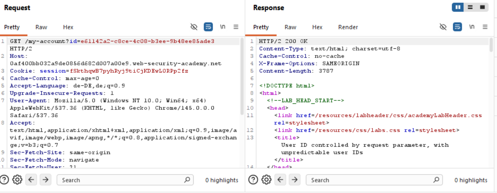
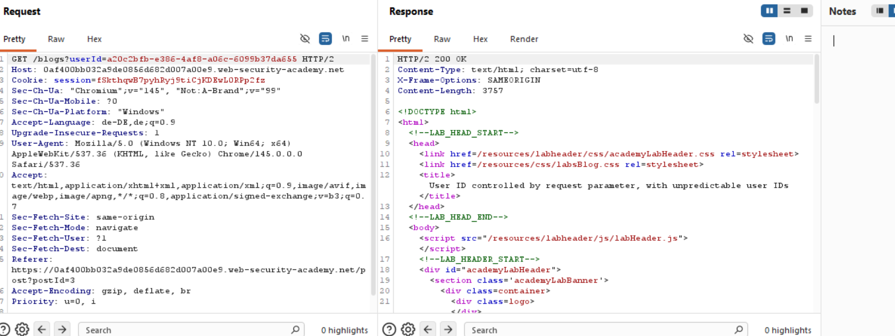
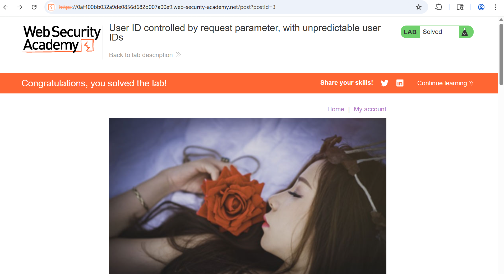

# 08-AC-userID-controlled-unpredictable-request-parameter

**AC User ID controlled by request parameter, with unpredictable user IDs**
*PortSwigger Web Security Academy - Apprentice*

## Vulnerability
The website verifies a request with a `user id`. The user id is nothing predictable like the `username`. This enhances security; 
still, the website is insecure, as the user id is used to address the `public account pages` of users.

## Tools
-Burp Repeater

## Attack Steps
### 1. observe the parameter
From our own user id we know bruteforcing is not possible and the user id is in the format `xxxxxxxx-xxxx-xxxx-xxxx-xxxxxxxxxxxx` and contains numbers, lower- and uppercase letters. Now we are able to recognize a user id if we see one.

### 2. search the id in other mechanisms
Websites tend to use the user id in parts of the website where you can access posts or public account information. In this case the website hosts a service for sharing blogs and uses the user id  as a `parameter` in a request to determine which users post or account is requested. Actually, you would not even have to trigger the request, as the user Id is visible on the html view which shows you the blog posted by the targeted user.
The request:

The specific location on the website:

### 3. final request
Replace your user id in the request from step 1 with the obtained id. The response should contain the `API key` of the targeted user.

## Proof

