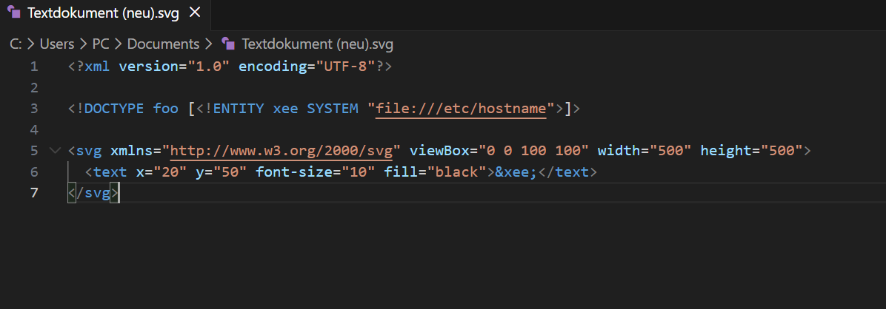
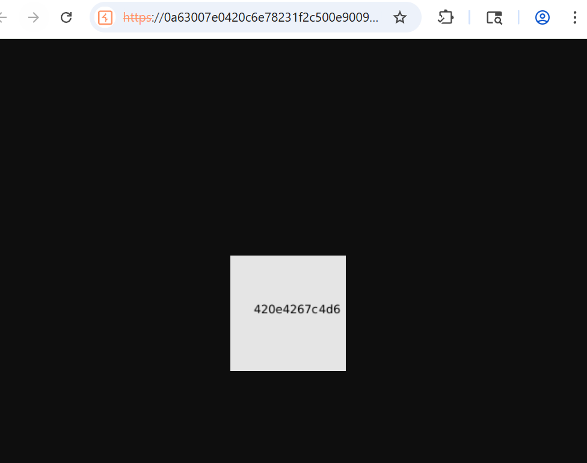

# 11-XXE-via-img-file-upload

**exploiting XXE via image file upload**

*PortSwigger Web Security Academy - Practicioner*

## Vulnerability
This website has a vulnerability in its profile avatar feature. `SVG` uses `XML`, which is processed on the server side and sent back to the frontend as a image.
## Tools
- Burb Proxy
## Attack Steps

### 1. create SVG
Create a SVG that loads the data from etc/hostname file into a text element.
The Entity holds the data and writes it in the text element.

### 2. upload
Upload the SVG through the comment feature. The SVG is transformed into a png and displays the hostname. 
Load the avatar in a seperate tab to inspect.

## Proof

