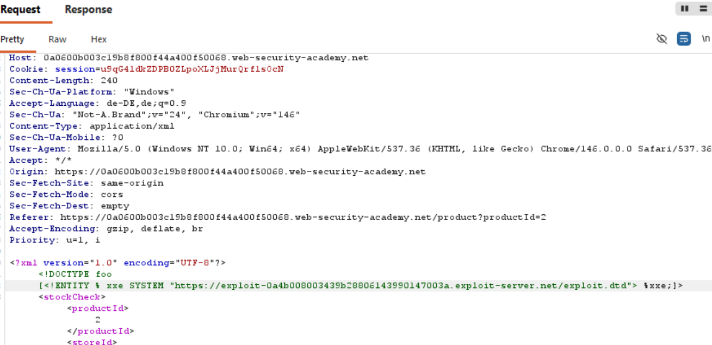
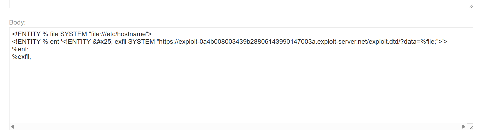

# 11-XXE-OOB-exfil

**Lab: Exploiting blind XXE to exfiltrate data using a malicious external DTD**

*PortSwigger Web Security Academy - Practitioner*

## Vulnerability
If we don't receive the information directly in the response the `XXE` is `blind` and we have to load the file we want to exfiltrate and then use this entity in another entity, which sends a request to a `exploit server` and delivers the file information per parameter. But in the `internal DTD` it is prohibited to insert a `parameter entity` into another entity.

So we have to load a external DTD from the exploit server, as external DTDs are allowed to expand a entity within a entity definition. 

## Preventions
The host should block out of band communication or if OOB is needed one would need to create a strict allowlist with all trusted external sources which could give rise to the complexity of the system.

## Tools
- Burb Proxy
- Labs exploit server
## Attack Steps

### 1. intercept the stock check request

### 2. internal DTD in request
We need to define a `parameter entity` that loads the `external DTD` hosted on the `exploit server` and call it. This simply loads the XML code and executes it.

### 3. external DTD setup
Now we have to create that external DTD. We create a entity,file, that loads the file. After that we have to create a entity,ent, that holds a string which keeps the definition of the system entity,exfil, that calls the exploit server URL with the file containments as a parameter. Than we call the entity that holds the string for the exfil entity so the exfil entity is defined and in the next step we call the exfil entity.

Nice to know: We must create the ent entity, because if we directly defined the exfil entity, we would have to insert the file entity into the exfil entity. This is not possible because XML wont't expand a parameter entity in a URI of a system entity.

### 4. execute
If we now send the request, we will be able to see two requests in the exploit server logs. One for the external DTD and the second because of the exfil entity. The second should contain the searched data.
