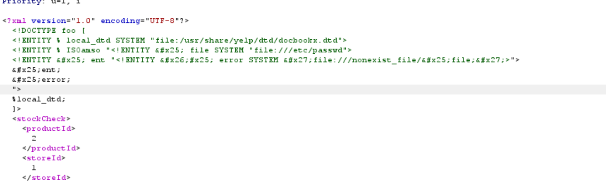

# 16-XXE-OOB-exfil

**Lab: Exploiting blind XXE to exfiltrate data using a malicious external DTD**

*PortSwigger Web Security Academy - Expert*

## Vulnerability
There is a restriction that prohibits to use a parameter entity within another parameter entity.  The website blocked OOB connections. Therefor it is impossible to bypass the rule via a OOB external DTD. Still, we can use a local external DTD that has a custom entity that we can define. Because plenty of local used files are open source, it shouldn't be difficult to detect one. At the start of the lab, local DTD file and the custom entity within are given.

## Preventions

## Tools
- Burb Proxy
## Attack Steps

### 1. intercept the request

### 2. Find a local DTD with a custom entity
Those two are given by the lab from the beginning.

### 3. Build the payload
We have to define the custom entity from the local DTD file in the local DTD. This entity holds the definition for the file entity (which loads the containments of the hostname file) and for the eval entity. The eval entity defines the error entity that loads a file name that doesen't exist but one  that contains the data we want to exfiltrate. This fie name is then reflected in a error message.

The process: The containments of the local external DTD file is stored in a SYSTEM entity. In that file the customisable entity, ISOamso, is called. We can define that entity by ourself.

In that entity we now write the string that defines the file entity with the vulnerable information and uses this param entity within a string entity that holds the definition for the SYSTEM entity, error, that searches for a nonexisting file name. In the filname the file entity is called. 

Then inside the ISOamso entity we also call the entity,ent, and after the entity error.

When the ISOamso entity is called in the file entity is defined and inserted into the ent entity, which is allowed, because those definitions are inside the external DTD. Then the entity, error, is called and the error message is in the response containing the path to the nonexisting file and the path contains the data.

## Proof

