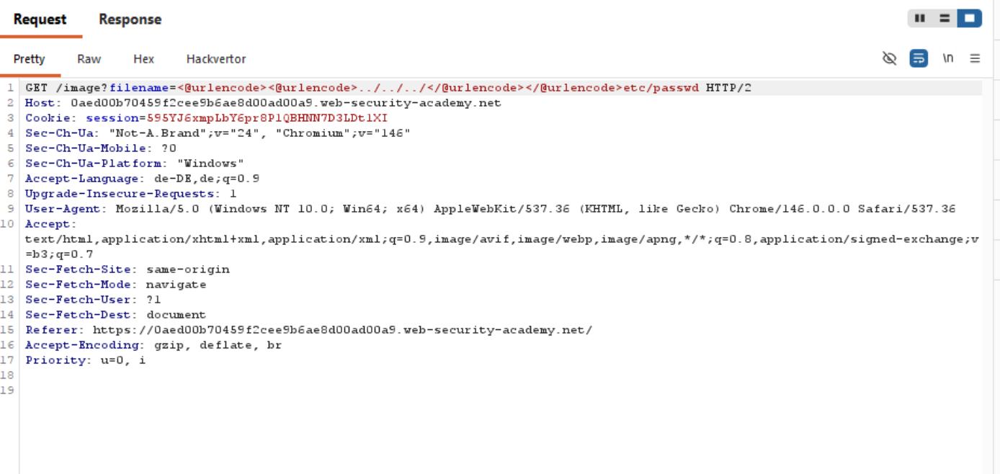
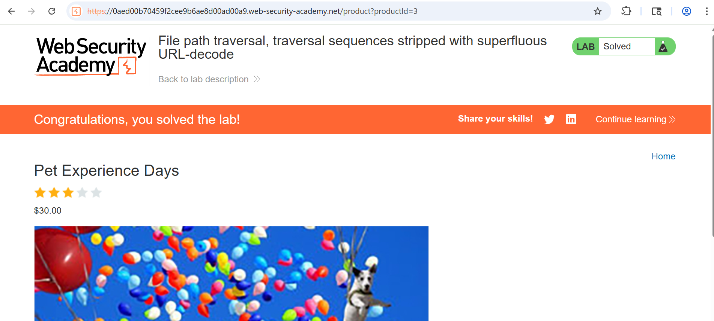

# 18-PT-URL-encode

**Lab:File path traversal, simple case**

*PortSwigger Web Security Academy - Apprentice*

## Vulnerability
The website takes a file name and inserts it in the base path where the images are. It defenses against path traversal by not accepting file paths containing `../` sequences or cutting them out. However it does filter after decoding it once, so we can encode the sequences twice and they will slip right through.

## Preventions

## Tools
- Burb Proxy
- Hackvertor

## Attack Steps

### 1. find file path
Escape the basepath with `../`. You may have to add several `../`. Then add the file you want to read and send the request.

### 2. encode the sequences
Put the `urlencode tags` around the sequences.

## Proof

