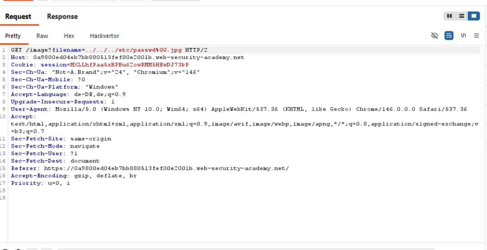
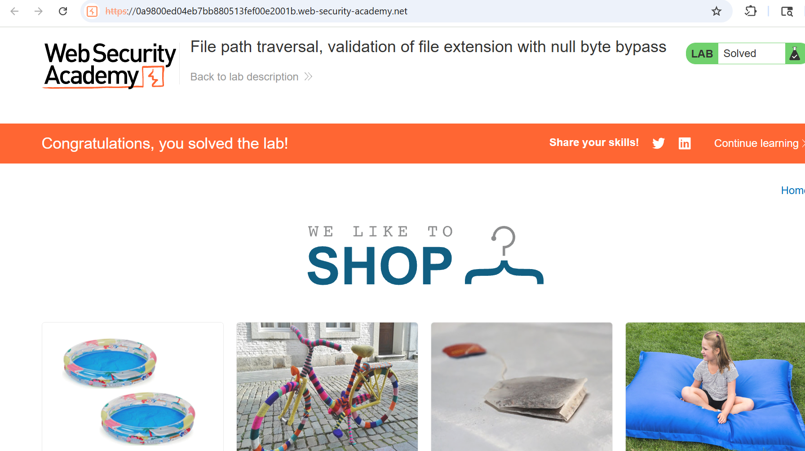

# 19-PT-file-extension-required

**Lab:**

*PortSwigger Web Security Academy - Practitioner*

## Vulnerability
The server validates wether the expected file extension is found at the end of the requested file path. We can bypass this by terminating the path before the file extension.
## Preventions

## Tools
- Burb Proxy

## Attack Steps

### 1. set file ending
Give the expected file extension at the end of the path. In this case it is `.jpg`. Then the path should look like this: `etc/passwd%00.jpg`

### 2. find file path
Like in the previous labs we have to escape the basepath with `../`. You may have to add several `../`. 
The final request looks like this:

## Proof

