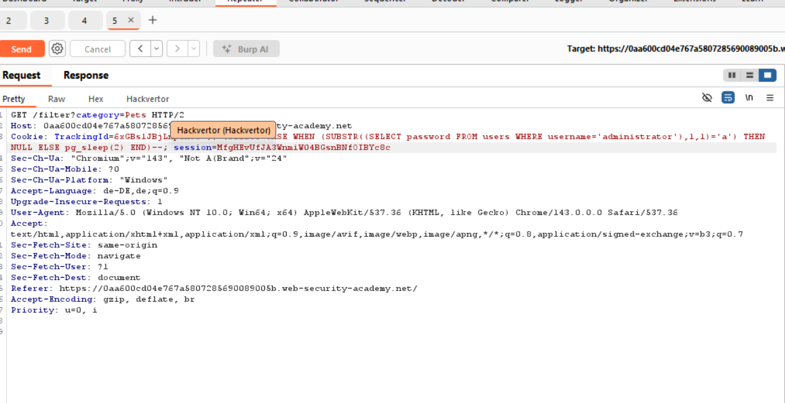
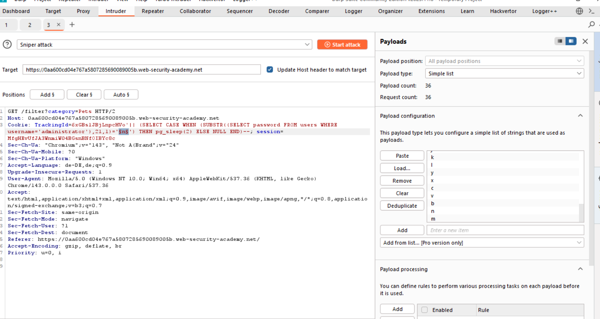

# 06-SQLi-conditional-time-delay

**SQL injection with filter bypass via XML encoding**
*PortSwigger Web Security Academy - Practitioner*

## Vulnerability
The parameters in the check stock feature are transmitted to the webserver in a XML body. A web application firewall, WAF, blocks all requests showing signs of threads such as SQLi. We can encode the SQLi payload so that the payload is decoded after it passed the filter.

## Tools
- Intruder
- Burp repeater
- Database cheat sheet

## Attack Steps

### 1. Find SQLi in request
The Lab tells us that there is a SQLi vuln in the check stock feature, yet we don't know which parameter is inserted into a SQL query on the backend.

### 2. build query

You might have to try the two posible syntax for `Postgre and Oracle`.
In this case it was `Postgre`.

### 3. use Intruder to enumerate the password
You could use a cluster bomb attack in order to be able to read the right symbol for the right index.
This attempt is solwer, as you can run 20 sniper attacks, so the attacks do not have to be completed.

